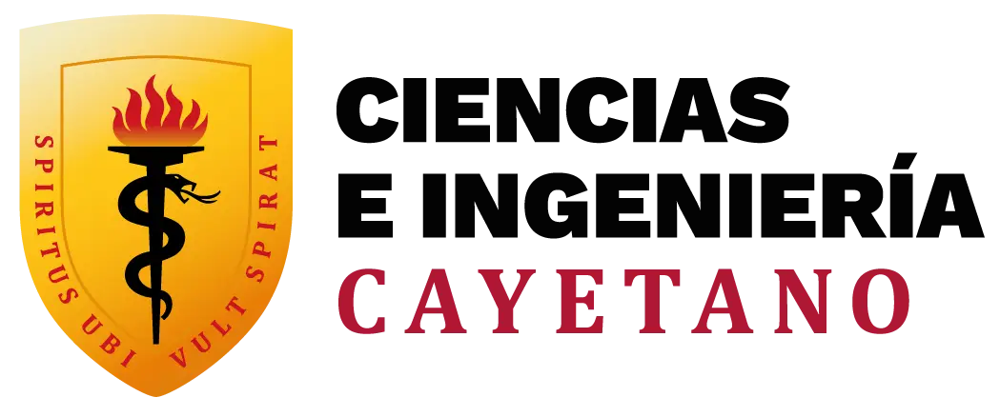

# GRUPO1-PI 1

# 🎓 UNIVERSIDAD PERUANA CAYETANO HEREDIA

## 🚀 Grupo 1 – Proyectos de Ingeniería I ⚙️

Bienvenidos al repositorio del Grupo 1 del curso **“Proyectos de Ingeniería I”** de la Universidad Peruana Cayetano Heredia. Este espacio integra la documentación, avances y entregables de nuestro proyecto académico, desarrollado bajo la metodología VDI 2206, que establece un enfoque sistemático para el diseño, desarrollo y validación de sistemas de ingeniería.

## 🎓 Universidad Peruana Cayetano Heredia

La Universidad Peruana Cayetano Heredia (UPCH) es reconocida por su excelencia académica y compromiso con la innovación científica y tecnológica en el Perú. Este curso busca que los estudiantes apliquen metodologías de ingeniería de manera rigurosa para desarrollar soluciones sostenibles y de impacto social.

## 🔎 Objetivo del Proyecto

Diseñar y desarrollar un sistema de monitoreo de suelos agrarios que permita medir en tiempo real variables críticas como humedad, temperatura y nutrientes (NPK), a fin de optimizar las decisiones de riego y fertilización. El proyecto está orientado a pequeños y medianos agricultores del VRAEM, contribuyendo a mejorar la productividad agrícola mediante una solución accesible, sostenible y validada bajo la norma VDI 2206.

## 📋 Contenido del Repositorio

Este repositorio incluye:

**Entregables:** Avances parciales y entregas oficiales del curso.
**Recursos:** Bibliografía, artículos técnicos y materiales de apoyo.
**Imágenes y Diagramas:** Representaciones visuales del prototipo y su evolución.
**README.md:** Este archivo, con la información general del proyecto.

## 🌟 Integrantes del Grupo 1
✔️ Andres Andres, Michael Geser
